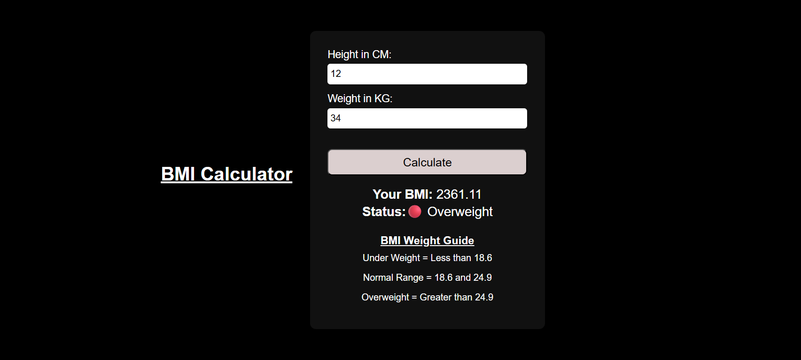

# 🧮 BMI Calculator

A simple and responsive **Body Mass Index (BMI) Calculator** built using **HTML, CSS, and JavaScript**.  
This project allows users to calculate their BMI based on height and weight and displays the health status as **Underweight, Normal, or Overweight**.

---

## 📸 Preview

---

## 🚀 Features

- 📏 Input height in centimeters
- ⚖️ Input weight in kilograms
- 🧠 Automatic BMI calculation
- 🎯 Displays BMI category:
  - Underweight
  - Normal Range
  - Overweight
- ❌ Input validation for incorrect values
- 📱 Responsive and modern UI design

---

## 🛠️ Technologies Used

- **HTML** – Structure of the application  
- **CSS** – Styling and responsive design  
- **JavaScript** – Logic, validation, and BMI calculation  

---

## 📐 BMI Formula Used

